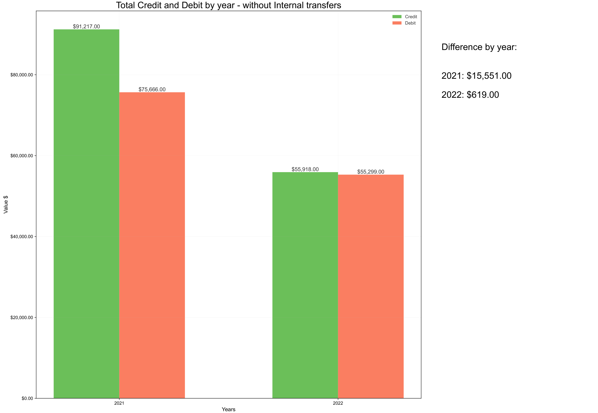
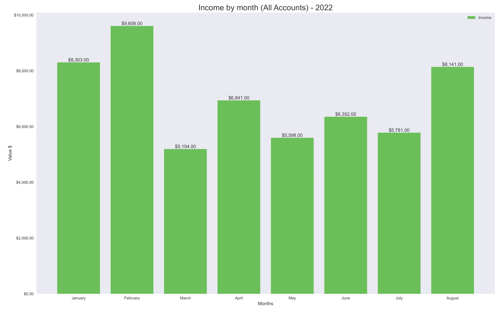
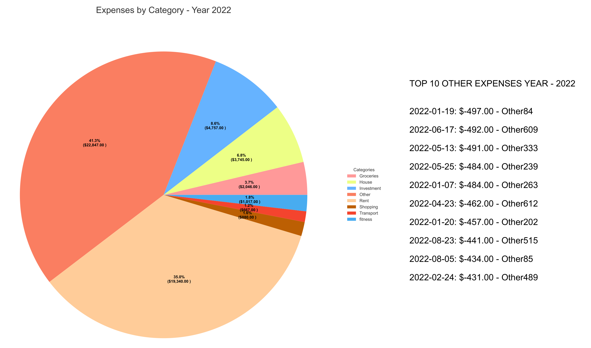
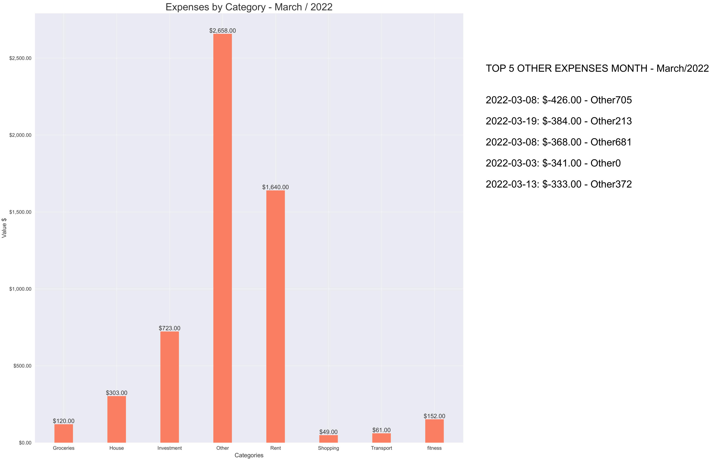

# Python ING bank reports

This project intend to create a small lightweight sqlite database with the everyday accounts from ING BANK Australia and run SQL queries to analyse it and print in PDF charts to vizualize it.

This generate a report of big picture about transactions, monthly income and where the money go in expenses **for multiple accounts together and separated automatically.**

Check screenshots in the end to see how the report looks like!

# Requirements
Python 3.7 or more
matplotlib 1.16.0

# How to use it:

You can use with mock data to play with the script and see results or with your real data and personalize it.

## With mock up data
- On the "CONFIG.py" change "IS_TEST" to True.
- Select the amount of accounts you want to simulate at 'AMOUNT_TEST'
- Run the main :)
- Check for erros in the console or the final report on the "Reports" folder

## Real Data
- On the "CONFIG.py" change "IS_TEST" to False.
- Go to the ING everyday account that you want the reports and download the transactions in csv format
- Change the name to "{anythingyouwant}-ING.csv" and add inside a folder "Input" in the same directory as the source code
- Add as much everyday accounts as you want!
- Run the main :)
- Check for erros in the console or the final report on the "Reports" folder
- Have insights and/or query more infomration with tools like POWER BI

# Personalize your results!
Change the file "CONFIG_CATEGORIES.py" - list of categories, regex matching and "if function" have your own filter about your expenses :)

The regex is as simple as it can be:
Add "|" and the unique name that appear on description between "()"

Change the color of the chars on CONFIG.py

# Goals

- Import ING bank files in CSV format
- Personalize your classification of the descriptions in a way useful to you
- Create a SQLite database with the information and category
- Do analyses of of the information
- Vizualization in PDF

# Obs
Right now the code produce the following reports:
- A Bar chart showing difference between income and expeses durring all the years that are in the csv
- A Pie chart showing the expenses of which category + 10 highest expenses that month (can change in config)
- A monthly analyses of the expeses through the current year (can change in cofig)

# Screenshots - Report and Meaning
This is a report generated with mock data and the CONFIG "IS_TEST = True" and "TEST_AMOUT = 1"

Difference Income/Expenses between years:

Income view by month

Pie chart categories per year + top 10 other category by year

Montlhy expenses + top 5 other category by month

P.S: the Other expenses are random everyday things like a concert or sending to a friend some money, some random store that doesn't match the categories configuration

## Note

If you have any sugestion/question please let me know so I can improve the quality of reports and insights.
Anyone is welcome to use it and adapt the CONFIG.py and CONFIG_CATEGORIES.py files and play with the results and queries.
You can also connect the banking.sqlite to PowerBI and do your onw dashboards.

## Note 2

I know I could use pandas for this. I am very familiar with it and already do those analyses using it :)

I want to practice my SQL best practices and interaction with database when I did this project, it was also a personal project for myselft and my fiance that I decided to share.

## Note 3

It can read also files from commonweath but the results are not good and there are a few challanges I was not willing to make:
- CBA does not offer csv files with more than 600 interactions and/or older than 2 years old
- CBA records internal transactions as "Trasfer to Transfer to xx<4_digits_bank>" making the classifying of internal movements hard

However, it will create the banking.sqlite file that you can access through a tool to query (i.e DB Browser (SQLCipher))
If you are also felling motivated chaging the CONFIG_CATEGORIES for your personal use 
or also use a tool for vizualization like PowerBI.
